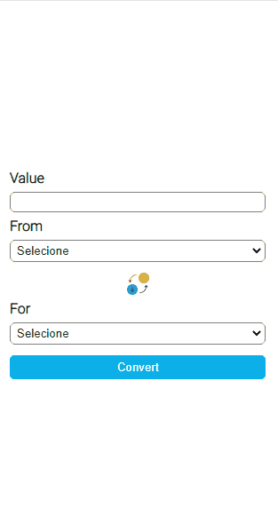
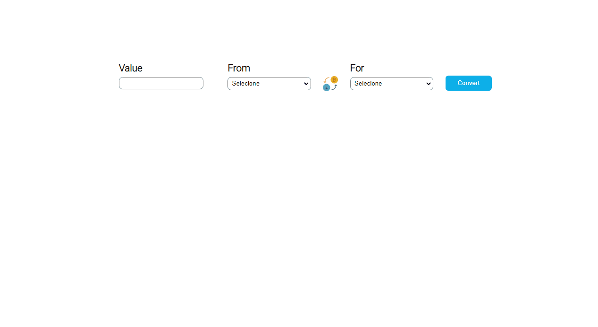

<h1 align="center" style="border-bottom: none">Simple currency converter</h1>

<h2 style="margin-top: 2rem" id="links">Links de navegação</h2>

  <a href="#descrição">Descrição</a> |
  <a href="#mobile">Mobile</a> |
  <a href="#desktop">Desktop</a> |
  <a href="#tecnologias">Tecnologias</a> |
  <a href="#testeaqui">Teste aqui</a> |
  <a href="#autor">Autor</a> 
  

 

<h2 id="descrição" >Descrição</h2>

Mini projeto de conversor de moedas simples, para práticar as linguagens Html, Css e JavaScript. Contêm seguintes moedas atualmente: Dólar Americano, Real Brasileiro, Euro, Iene, Dólar Canadense, Peso Argentino etc... Pra conseguir o valor atual da contação das moedas, consumi uma api gratuita, segue o link aonde encontrei essa api: <a href="https://docs.awesomeapi.com.br/api-de-moedas">Api de moedas</a>. Além do mais, o conversor já é responsivo na maioria dos dispositivos. É bom salietar que esse mini conversor está em construção, vou tentar aprimorar ele em decorrer do meu apredizado, sempre tentando implementar novas melhorias.

 

<h2 id="mobile">Mobile</h2>

 

<h1 align="center" style="border-bottom: none">
  
</h1>

 

<a href="#links" style="font-size: 0.7rem">Go Back To Top</a>

 

<h2 id="desktop">Desktop</h2>

 

<h1 align="center" style="border-bottom: none">
  
</h1>

 

<a href="#links" style="font-size: 0.7rem">Go Back To Top</a>

 

<h2 id="tecnologias">Tecnologias</h2>

 

As seguintes tecnologias foram usadas no mini projeto:

- [Html](https://developer.mozilla.org/pt-BR/docs/Web/HTML)
- [Css](https://developer.mozilla.org/pt-BR/docs/Web/CSS)
- [JavaScript](https://developer.mozilla.org/pt-BR/docs/Web/JAVASCRIPT)

 

<a href="#links" style="font-size: 0.7rem">Go Back To Top</a>

 

<h2 id="testeaqui">Teste Aqui</h2>

<a href="https://diogofranca.github.io/currency-converter/">Github pages</a>

 

<a href="#links" style="font-size: 0.7rem">Go Back To Top</a>

 

<h2 id="autor">Autor</h2>

Made with ❤️ by Diogo França 🎉

 

<a href="#links" style="font-size: 0.7rem">Go Back To Top</a>

 

